<div align="center">

</div>

<div align="center">

```
 ██████╗ ██████╗ ██████╗ ███████╗    ██╗    ██╗██╗████████╗██╗  ██╗    ████████╗███████╗ █████╗
██╔════╝██╔═══██╗██╔══██╗██╔════╝    ██║    ██║██║╚══██╔══╝██║  ██║    ╚══██╔══╝██╔════╝██╔══██╗
██║     ██║   ██║██║  ██║█████╗      ██║ █╗ ██║██║   ██║   ███████║       ██║   █████╗  ███████║
██║     ██║   ██║██║  ██║██╔══╝      ██║███╗██║██║   ██║   ██╔══██║       ██║   ██╔══╝  ██╔══██║
╚██████╗╚██████╔╝██████╔╝███████╗    ╚███╔███╔╝██║   ██║   ██║  ██║       ██║   ███████╗██║  ██║
 ╚═════╝ ╚═════╝ ╚═════╝ ╚══════╝     ╚══╝╚══╝╚═╝   ╚═╝   ╚═╝  ╚═╝       ╚═╝   ╚══════╝╚═╝  ╚═╝
```

<br/>

[](https://git.io/typing-svg)

<br/>


&nbsp;

&nbsp;

&nbsp;

&nbsp;


</div>

---

<div align="center">

<!-- This SVG lives in your repo at /terminal.svg — animated terminal + radar -->


</div>

---

## `> WHO IS BEHIND THIS`

<table>
<tr>
<td width="58%" valign="top">

**I'm Tanmaya** — the person behind `codewithtea`.

Python is my primary language and my default way of thinking. But I go beyond one layer: I build complete full-stack products with the MERN stack, craft high-end web animations with GSAP, Three.js, and WebGL, and ship AI/ML systems that run in production — not just notebooks.

I document all of it on **[YouTube → codewithtea](https://www.youtube.com/@Codewith_Tea)** — real builds, real code, zero fluff.

No specialization walls. No "that's not my job." If the system needs it, I build it.

> *"Most developers know a tool. I understand the layer it sits on."*

</td>
<td width="42%" valign="top">

```python
class Tanmaya:
    alias    = "codewithtea"
    location = "India"

    languages = [
        "Python",       # primary ★
        "TypeScript",
        "JavaScript",
        "SQL", "Bash",
    ]

    stack = {
        "backend"    : ["FastAPI", "Django", "Node", "Express"],
        "frontend"   : ["React", "Next.js", "Tailwind"],
        "animations" : ["GSAP", "Three.js", "Framer Motion"],
        "ai_ml"      : ["PyTorch", "LangChain", "HuggingFace"],
        "devops"     : ["Docker", "GitHub Actions", "AWS"],
    }

    content  = "youtube.com/@Codewith_Tea"
    fuel     = "☕"
    open_to  = "collabs · contracts · ambitious builds"
```

</td>
</tr>
</table>

---

## `> CAPABILITY MAP`

```
╔════════════════════════════════════════════════════════════════════════════════════╗
║                                                                                    ║
║   PYTHON / BACKEND    ███████████████████████████████████████  APIs · async · ORM ║
║   AI / ML             █████████████████████████████████░░░░░░  NLP · CV · Agents  ║
║   FULL-STACK MERN     ████████████████████████████████░░░░░░░  End-to-end web     ║
║   ANIMATIONS & 3D     ███████████████████████████████░░░░░░░░  GSAP · Three.js    ║
║   DEVOPS & CLOUD      ██████████████████████████████░░░░░░░░░  Docker · CI/CD     ║
║   DATA ENGINEERING    █████████████████████████████░░░░░░░░░░  Pipelines · DBs    ║
║                                                                                    ║
╚════════════════════════════════════════════════════════════════════════════════════╝
```

---

## `> TECH STACK`

<div align="center">

**─── Languages ───**


**─── Backend & APIs ───**


**─── Frontend ───**


**─── Creative & Animations ───**


**─── AI / ML ───**


**─── Databases ───**


**─── DevOps & Cloud ───**


</div>

---

## `> ON YOUTUBE`

<div align="center">

[](https://www.youtube.com/@Codewith_Tea)

</div>

<br/>

Real projects. Real code. No slides, no hand-waving — just building from scratch, on camera, with tea. Python engineering, MERN builds, creative animations, and system design that actually makes sense when you see it run.

> Subscribe if you want to watch ideas become production-ready software.

---

## `> COMMUNITY`

<div align="center">

[](https://www.reddit.com/r/projectpython/)

</div>

<br/>

A community for Python developers who actually ship things — project showcases, code reviews, architecture discussions, real feedback from people who build.

---

## `> CONNECT`

<div align="center">

<br/>

[](https://www.youtube.com/@Codewith_Tea)
&nbsp;&nbsp;
[](https://www.linkedin.com/in/creatingbestforyou/)
&nbsp;&nbsp;
[](https://x.com/Tanmayaq)

<br/>

[](https://www.reddit.com/user/chop_chop_13/)
&nbsp;&nbsp;
[](https://www.reddit.com/r/projectpython/)
&nbsp;&nbsp;
[](mailto:tea858880@gmail.com)

<br/><br/>


<br/><br/>

```
╔═══════════════════════════════════════════════════════════════════════╗
║                                                                       ║
║   I build in public.  I document everything I learn.                 ║
║   If you're building something ambitious — let's make it real.       ║
║                                                                       ║
╚═══════════════════════════════════════════════════════════════════════╝
```

</div>

<br/>

<div align="center">

</div>
